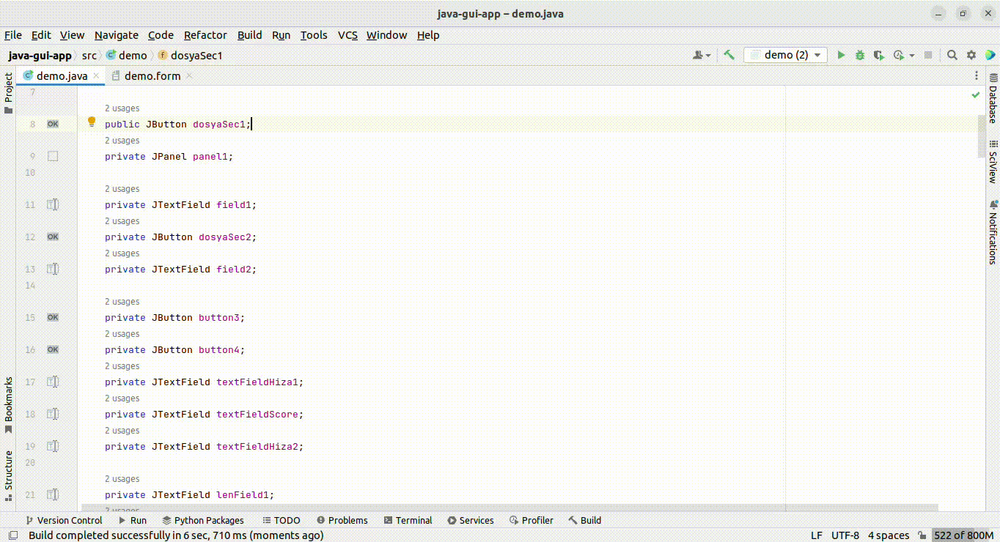
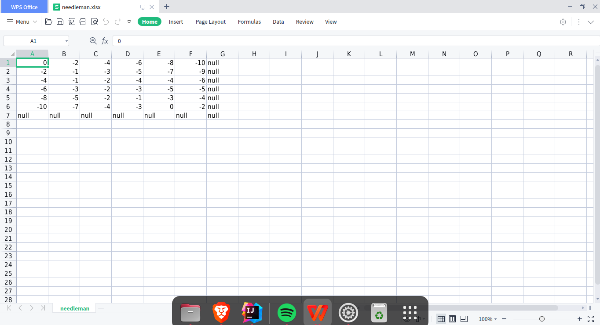

# needleman-wunsch-app-gui

<h1>Çıktı</h1>





<h1>Kullanım</h1>

Projeyi klonlayın

```
git clone https://github.com/mtamerb/needleman-wunsch-app-gui.git

```
<p>Ardından IDE vs. gerekli ayarları tamamlayın .</p>

<p> src/demo.java dosyası içersindeki  export.addActionListener içindeki -- FileOutputStream("/home/tamerb/Downloads/needleman.xlsx") -- yerine kendi path ekleyin

